# “社团讲”
“社团讲”社团管理系统、小程序

> ### 背景
学生报名社团或参加活动时，通常需要学生到现场填写报名表等，有时学生会遇到找不到报名地点，错过报名时间等问题。社团活动人员也会出现统计错误，遗漏等问题

> ### 定位
为了解决学生报名难等问题，同学可以通过微信小程序报名，提交信息。同时也可以通过微信小程序订阅消息接收报名情况反馈

> ### 技术
    前端：微信小程序、ColorUI、wxParse(使html按样式转化为wxml)
    后端：ThinkPHP、基于RESTful api接口规范
    后台CMS：ThinkPHP、LayerUI等
> ### 具体
* 采用模拟登陆的方式对接华软Myscse系统，来验证学生身份信息
* 采用token 令牌机制，提交数据时，需携带有效的token
* 对接微信小程序的订阅消息发送通知
* 使用Redis的消息队列来达到发送邮箱、订阅消息时一个生产者与消费者的关系、分布式

> ### 效果展示
* [微信小程序](https://github.com/Brant-lzh/Clubs_miniprogram)

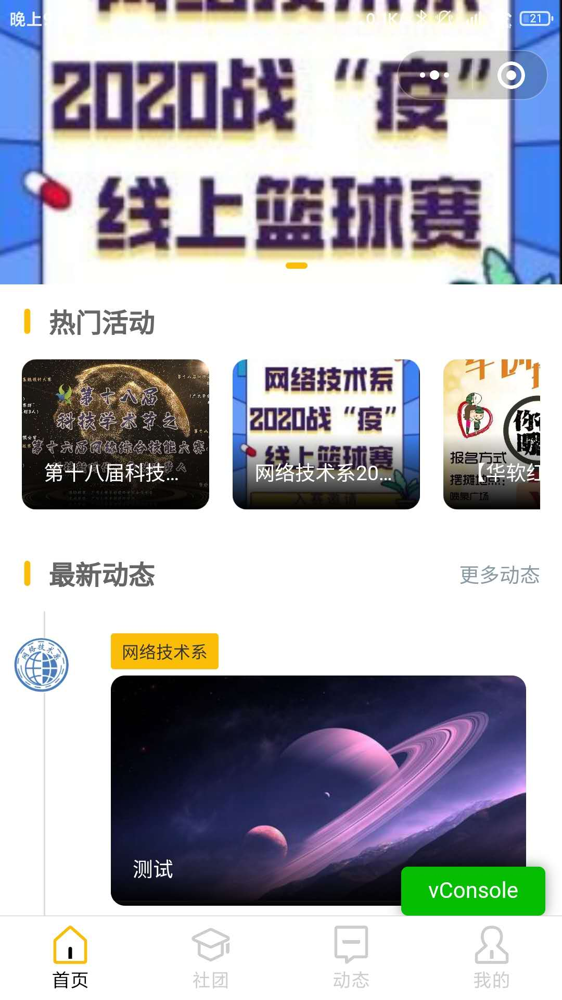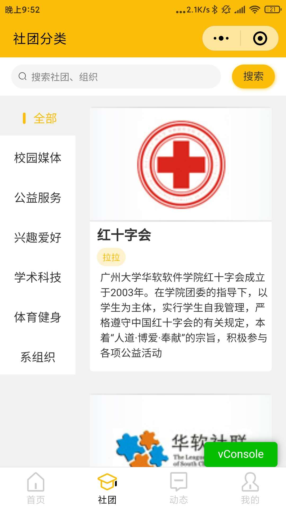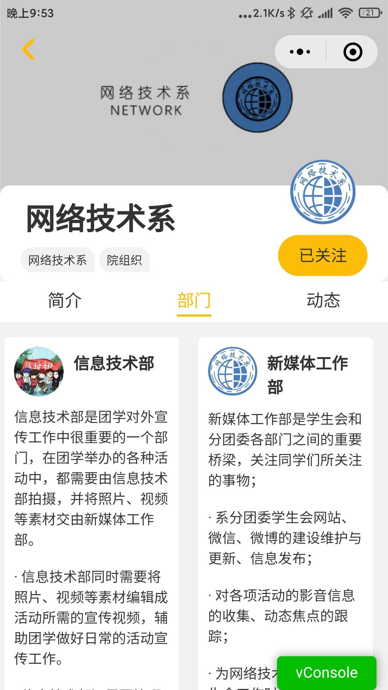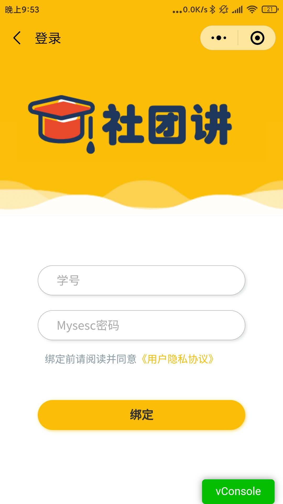
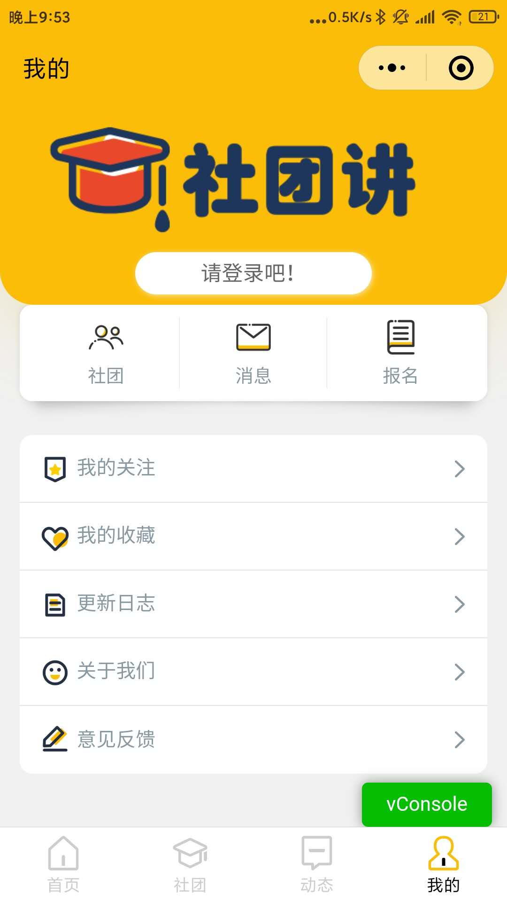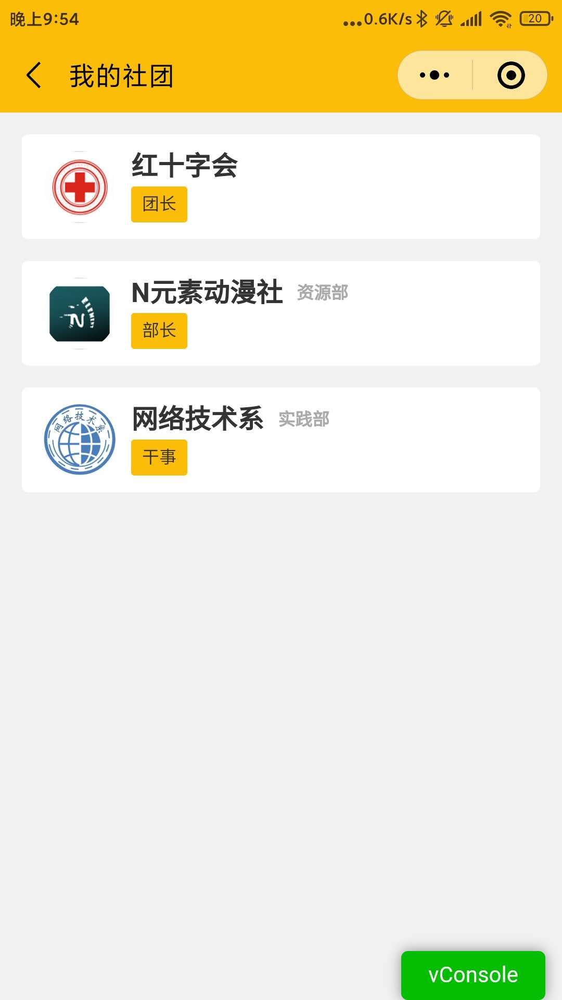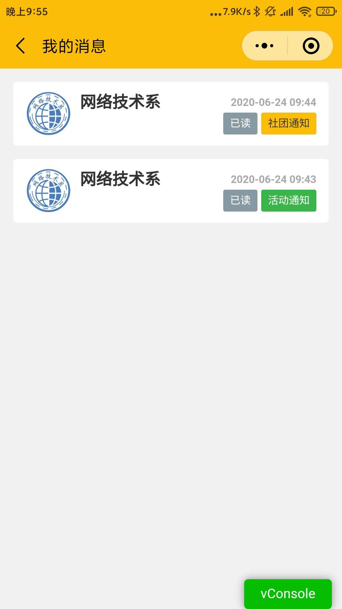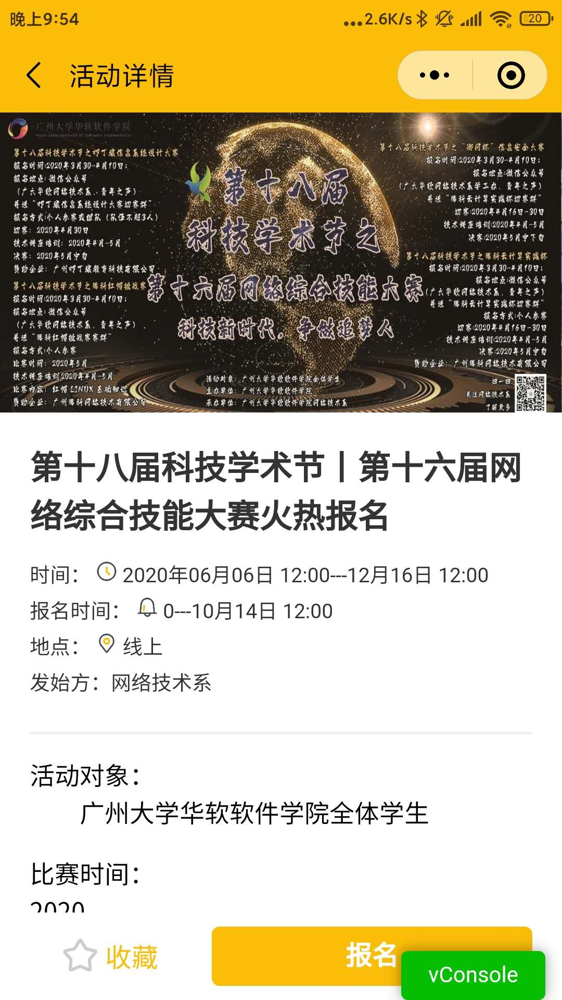

* 后台
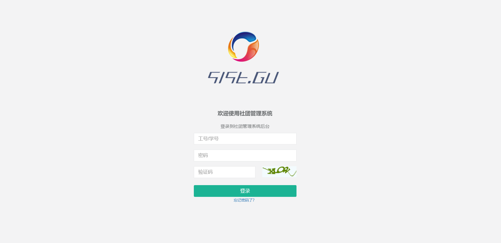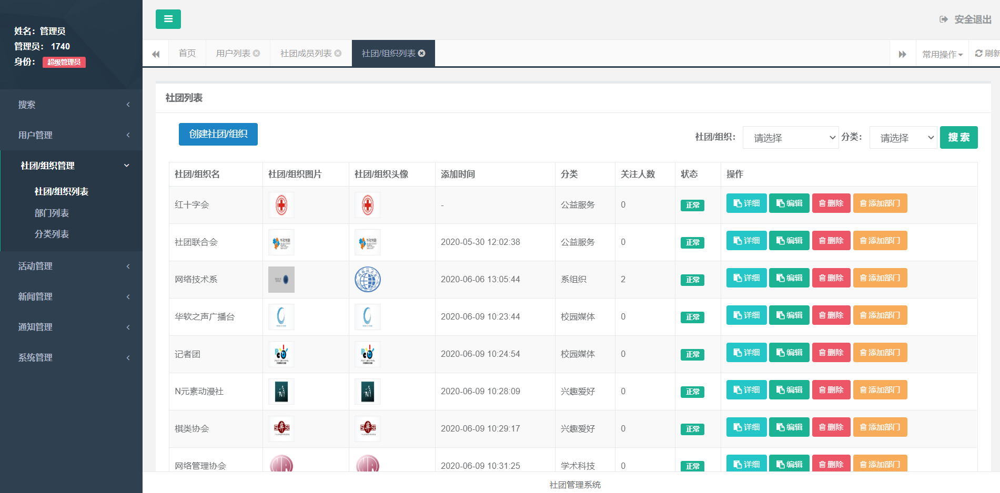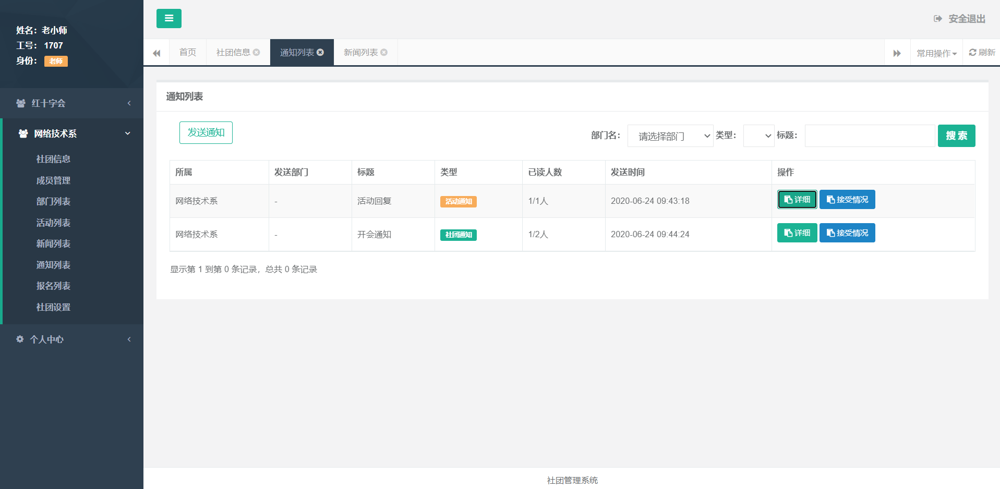
> ### 最后
后台CMS代码、和数据库等，到时也会开源上传。
需要配置/application/extra里的文件参数